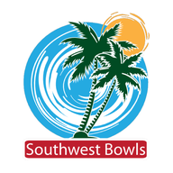

<p align="center">
  
</p>

<h1 align="center">Southwest Bowls — swlawnbowls.org</h1>

<p align="center">
  The website of the <strong>Southwest Bowls Division</strong> of lawn bowls:
  tournaments, results, news and club information from Cambria to San Diego.<br>
  <a href="https://www.swlawnbowls.org"><strong>www.swlawnbowls.org</strong></a>
  · <a href="https://www.swlawnbowls.org/get-the-app">Add it to your phone</a>
</p>

---

## Updating the site means editing data, not code

Almost everything on the site comes from a few data files. To publish a
tournament, a result or a page, you change one of them. There is no HTML to
write.

| To change… | Edit | Shows up at |
|---|---|---|
| A tournament (date, venue, entry form, live scoring) | `events-data.json` | `/event?id=<id>` and the home page |
| Results for this season | `results-data.json` | `/2026-tournament-results` |
| An information page (About Us, Umpires, Ladies Day…) | `content/<id>.json` | `/<id>` |
| The menu | `nav-data.json` | Every page |
| The news panel | `news-data.json` | Home page |
| The historical archive | `archive-data.json` | `/archive` |

Then:

```
edit a data file  →  commit  →  push to main  →  live in about a minute
```

Pushing to `main` publishes immediately. There is no staging site, so check
that a data file is valid before pushing:

```
python3 -c "import json; json.load(open('events-data.json'))"
```

The step-by-step recipes (adding a tournament, publishing results with
photos, creating a page) are in [CLAUDE.md](CLAUDE.md). Information pages
follow [docs/page-content-schema.md](docs/page-content-schema.md).

## The app

The site installs on phones as an app (a PWA). There's no app store and
nothing to publish separately: the app *is* the website, so every update to
the site is in the app the next time it is opened. Install instructions for
members are at [/get-the-app](https://www.swlawnbowls.org/get-the-app).

| File | What it does |
|---|---|
| `manifest.webmanifest` | App name, colours, icons and home-screen shortcuts |
| `sw.js` | Offline helper. Always fetches fresh pages, and falls back to saved copies only without a signal |
| `pwa.js` | Adds the icon and the "Add to your phone" button. Loaded by `site-nav.js` |
| `assets/icons/` | App icons, made from the SWD logo |

## What's in the repository

| Path | Contents |
|---|---|
| `*.json` (root) | The data files listed above |
| `*.html` (root) | Page templates: `event.html`, `page.html`, `results_new.html`, `site-home.html`, … |
| `content/` | One JSON file per information page |
| `photos/` | Tournament photos, page images and the rescued results archive |
| `pdfs/` | Entry forms, conditions of play and policies |
| `api/` | Serverless functions: the calendar feed, agenda PDF, live scoring |
| `scripts/` | One-off maintenance tools: archive rescue, Google Forms setup |
| `docs/` | Schemas, form links, accounts and handover notes |
| `vercel.json` | Every public address, and the forwards from old Squarespace links |

## Hosting

The site is hosted on [Vercel](https://vercel.com), which deploys every push to
`main` automatically. The serverless functions read these environment variables,
set in the Vercel project settings and never in code:

| Variable | Used for |
|---|---|
| `GCAL_API_KEY` | Reading the five SWD Google Calendars |
| `GCAL_CACHE_MINUTES` | How long the calendar feed is cached |
| `GOOGLE_SERVICE_ACCOUNT_JSON` | Google access for entry-capacity checks and the calendar link sync |
| `TOURNAMENTS_INDEX_CSV_URL` | The published tournaments index sheet |
| `SESSION_SECRET`, `USERS` | Sign-in for the publisher tools |
| `CRON_SECRET` | Protecting the calendar link-sync job |

Who holds which account (Vercel, GitHub, Google, the domain) is recorded in
[docs/succession-and-accounts.md](docs/succession-and-accounts.md).

## Ground rules

- **Player names are a permanent record.** Copy them exactly as the source
  has them. Never quietly correct a spelling.
- **Images live in this repository.** Never link to images hosted elsewhere.
  Shrink photos *before* committing, because a large file stays in git history
  forever.
- **Check what else reads a data file before changing its shape.** Several
  pages share `results-data.json` and `events-data.json`.

---

<p align="center"><sub>Southwest Bowls Division · Bowls USA · Lawn bowling in Southern California</sub></p>
